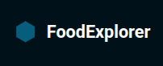

<h1 align = "center">
  
</h1>

## Sobre o projeto

O projeto final Rocketseat FoodExplorer é uma aplicação web desenvolvida para um restaurante fictício. Nela, um usuário deve ter a capacidade de, ao se cadastrar na página e realizar o seu Login, criar novos pratos (caso seja um usuário **admin**), visualizar e editar esses pratos. Já caso o usuário seja um **customer**, ele deverá poder, ao se cadastrar na página e se autenticar, visualizar os pratos criados e adicioná-los aos seus pedidos. Além disso, todos os usuários possuem a capacidade de alterar seus perfis (avatar, nome, email e senha). Por fim, o projeto conta com telas responsivas a diversos aparelhos (mobile e desktop) para melhor experiência do usuário. 

## Como utilizar o projeto

### Versão admin da aplicação

```bash

  # E-mail: felipe@admin.com
  # senha: 123

```

### Versão customer (usuário comum) da aplicação

```bash

  # E-mail: joao@email.com
  # senha: 123456

```
 
### Executando o Backend do projeto

```bash

  # Vá até o diretório do projeto
  $ cd API-Backend-FoodExplorer

  # Crie um arquivo .env e insira os valores desejados para:
    AUTH_SECRET = /*Ex.: default*/
    PORT = /*Ex.: 3333*/

  # Instale a dependência node_modules
  $ npm install

  # Inicie o servidor 
  $ npm run dev

  # Agora, com o frontend também aberto, basta utlizar a aplicação normalmente 

```

## Tecnologias utilizadas 

- [NodeJS](https://nodejs.org/en)
- [Javascript]()
- [Nodemon](https://nodemon.io/)
- [Express](https://expressjs.com/pt-br/)
- [Express Async Errors](https://www.npmjs.com/package/express-async-errors)
- [Insomnia](https://insomnia.rest/download)
- [SQLite](https://www.sqlite.org/)
- [Beekeeper Studio](https://www.beekeeperstudio.io/)
- [KnexJS](https://knexjs.org/)
- [BcryptJS](https://www.npmjs.com/package/bcryptjs)
- [JSON Web Token (JWT)](https://www.npmjs.com/package/jsonwebtoken)
- [Multer](https://www.npmjs.com/package/multer)
- [Cors](https://www.npmjs.com/package/cors)
- [Dotenv (.env)](https://www.npmjs.com/package/dotenv)
- [PM2](https://pm2.keymetrics.io/)

### - NodeJS

É um ambiente de execução (ou Framework) JavaScript voltado ao lado do servidor (backend). 

### - Javascript

Linguagem de programação de tipagem fraca (não exige que o tipo de uma variável ou função seja declarado quando ela é criada) amplamente utilizada para a criação de páginas Web. Pode ser utilizada tanto no frontend (ex.: ReactJS) quanto no backend (ex.: NodeJS).

### - Nodemon

Ferramenta de linha de comando utilizada para o desenvolvimento de aplicações NodeJS. Sua função é monitorar a aplicação e reiniciá-la quando forem detectadas alterações.

### - Express

Framework NodeJS criado para otimizar a criação de aplicativos e APIs Web.

### - Express Async Errors

Pacote responsável pelo tratamento de erros em aplicações Web.

### - Insomnia

Aplicativo Web que permite o envio de solicitações HTTP a APIs Web para a otimização de sua testagem.

### - SQLite

É um banco de dados relacional de código aberto capaz de funcionar em aplicações Web e Mobile.

### - Beekeeper Studio

Ferramenta de gerenciamento de bancos de dados que permite a criação e a realização de consultas, gerenciar conexões e visualizar dados.

### - KnexJS

É um Query Builder SQL para JavaScript que permite acessar e executar ações em bancos de dados.

### - BcryptJS

É uma biblioteca voltada à criação de hashes seguros para a proteção de senhas, principalmente.

### - JSON Web Token (JWT)

É um padrão de autenticação que permite a transmissão de informações de forma segura entre duas partes em uma aplicação Web. 

### - Multer

Biblioteca NodeJS voltada à realização do upload de arquivos.  

### - Dotenv (.env)

Arquivo oculto que contém variáveis de ambiente de uma aplicação Web. É usado para definir configurações que variam de acordo com o local em que a aplicação está sendo executada.

### - PM2

Gerenciador de processos de código aberto que permite controlar aplicações NodeJS.
